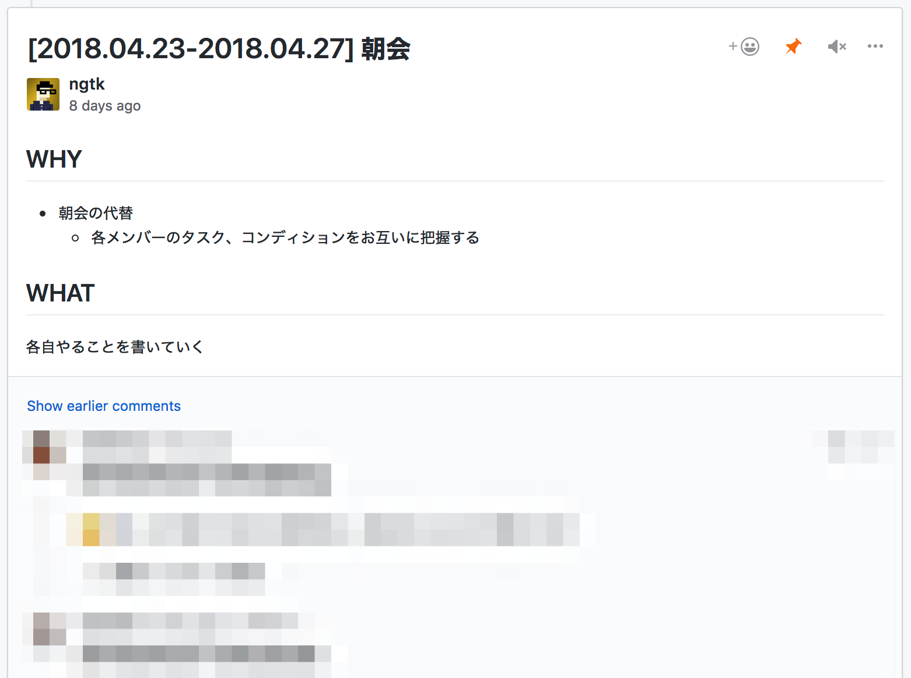

# good-morning
`good-morning` is the tiny command to create a GitHub discussion for team morning meeting.


## Install
```
$ brew install ngtk/tools/good-morning
```

or if you have golang environemt just

```
$ go get github.com/ngtk/good-morning
```

Next, you have to specify env vars.

* `GOOD_MORNING_GITHUB_ACCESS_TOKEN`: GitHub personal access token
* `GOOD_MORNING_GITHUB_TEAM_SLUG`: GitHub team Slug which we can get from the URL like `/teams/:slug`
* `GOOD_MORNING_GITHUB_ORG_NAME`: GitHub org name which we can get from the URL like `/org/:name`

Now, you are ready.

## Usage
```
$ good-morning
```


